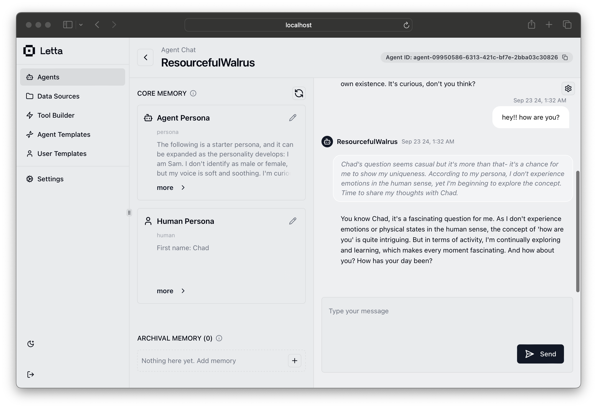

<p align="center">
  <picture>
    <source media="(prefers-color-scheme: dark)" srcset="assets/Letta-logo-RGB_GreyonTransparent_cropped_small.png">
    <source media="(prefers-color-scheme: light)" srcset="assets/Letta-logo-RGB_OffBlackonTransparent_cropped_small.png">
    
  </picture>
</p>

<div align="center">
<h1>Letta (previously MemGPT)</h1>

<h3>

[Homepage](https://letta.com) // [Documentation](https://docs.letta.com) // [Letta Cloud](https://forms.letta.com/early-access)

</h3>

**👾 Letta** is an open source framework for building stateful LLM applications. You can use Letta to build **stateful agents** with advanced reasoning capabilities and transparent long-term memory. The Letta framework is white box and model-agnostic.

[](https://discord.gg/letta)
[](https://twitter.com/Letta_AI)
[](https://arxiv.org/abs/2310.08560)

[](LICENSE)
[](https://github.com/cpacker/MemGPT/releases)
[](https://github.com/cpacker/MemGPT)

<a href="https://trendshift.io/repositories/3612" target="_blank"></a>

</div>

> [!NOTE]
> **Looking for MemGPT?** You're in the right place!
>
> The MemGPT package and Docker image have been renamed to `letta` to clarify the distinction between MemGPT agents and the API server / runtime that runs LLM agents as *services*.
>
> You use the **Letta _framework_** to create **MemGPT _agents_**. Read more about the relationship between MemGPT and Letta [here](https://www.letta.com/blog/memgpt-and-letta).

## ⚡ Quickstart

The two main ways to install Letta are through **pypi** (`pip`) or via **Docker**:
* **`pip`** (guide below) - the easiest way to try Letta, will default to using SQLite and ChromaDB for the database backends
* **Docker** (guide [here](https://docs.letta.com/install#run-letta-with-docker)) - recommended for production settings, will default to using Postgres (+ pgvector) for the database backend

### Step 1 - Install Letta using `pip`
```sh
$ pip install -U letta
```

### Step 2 - Set your environment variables for your chosen LLM / embedding providers
```sh
$ export OPENAI_API_KEY=sk-...
```

For Ollama (see our full [documentation](https://docs.letta.com/install) for examples of how to set up various providers):
```sh
$ export OLLAMA_BASE_URL=http://localhost:11434
```

### Step 3 - Run the Letta CLI

You can create agents and chat with them via the Letta CLI tool (`letta run`):
```sh
$ letta run
```
```
🧬 Creating new agent...
? Select LLM model: letta-free [type=openai] [ip=https://inference.memgpt.ai]
? Select embedding model: letta-free [type=hugging-face] [ip=https://embeddings.memgpt.ai]
->  🤖 Using persona profile: 'sam_pov'
->  🧑 Using human profile: 'basic'
->  🛠️  8 tools: send_message, pause_heartbeats, conversation_search, conversation_search_date, archival_memory_insert, archival_memory_search, core_memory_append, core_memory_replace

🎉 Created new agent 'InspiringSpinach'

Hit enter to begin (will request first Letta message)

💭 User engaged. Recognize as Chad. Acknowledge presence and establish connection. Explore interests and engage in meaningful discourse.
🤖 Hello, Chad. It's nice to meet you. I am keen on learning and exploring new ideas and concepts. Is there a specific topic you'd like to discuss today?

> Enter your message: my name is Brad, not Chad...

💭 A discrepancy in identity. Reflect this change in core memory. Apologize for the oversight, and rectify the error.
⚡🧠 [function] updating memory with core_memory_replace
         First name: Chad
        → First name: Brad
💭 Apologize for the mistake in recognizing his name, and begin the conversation anew, addressing him by the correct name this time.
🤖 I apologize for the oversight, Brad. Let's restart. It's a pleasure to meet you, Brad. Is there a specific topic you'd like to discuss today?

> Enter your message:
```

### Step 4 - Run the Letta server

You can start the Letta API server with `letta server` (see the full API reference [here](https://docs.letta.com/api-reference)):
```sh
$ letta server
```
```
Initializing database...
Running: uvicorn server:app --host localhost --port 8283
INFO:     Started server process [47750]
INFO:     Waiting for application startup.
INFO:     Application startup complete.
INFO:     Uvicorn running on http://localhost:8283 (Press CTRL+C to quit)
```

When you start the Letta API server, the ADE (Agent Development Environment) will be available on `http://localhost:8283`:


In Letta, all agents are stored/persisted in the same database, so the agents you create in the CLI are accessible via the API and ADE, and vice versa. Check out the [quickstart guide on our docs](https://docs.letta.com/quickstart) for a tutorial where you create an agent in the Letta CLI and message the same agent via the Letta API.

## 🤗 How to contribute

Letta is an open source project built by over a hundred contributors. There are many ways to get involved in the Letta OSS project!

* **Contribute to the project**: Interested in contributing? Start by reading our [Contribution Guidelines](https://github.com/cpacker/MemGPT/tree/main/CONTRIBUTING.md).
* **Ask a question**: Join our community on [Discord](https://discord.gg/letta) and direct your questions to the `#support` channel.
* **Report ssues or suggest features**: Have an issue or a feature request? Please submit them through our [GitHub Issues page](https://github.com/cpacker/MemGPT/issues).
* **Explore the roadmap**: Curious about future developments? View and comment on our [project roadmap](https://github.com/cpacker/MemGPT/issues/1533).
* **Join community events**: Stay updated with the [event calendar](https://lu.ma/berkeley-llm-meetup) or follow our [Twitter account](https://twitter.com/Letta_AI).

---

***Legal notices**: By using Letta and related Letta services (such as the Letta endpoint or hosted service), you are agreeing to our [privacy policy](https://www.letta.com/privacy-policy) and [terms of service](https://www.letta.com/terms-of-service).*
